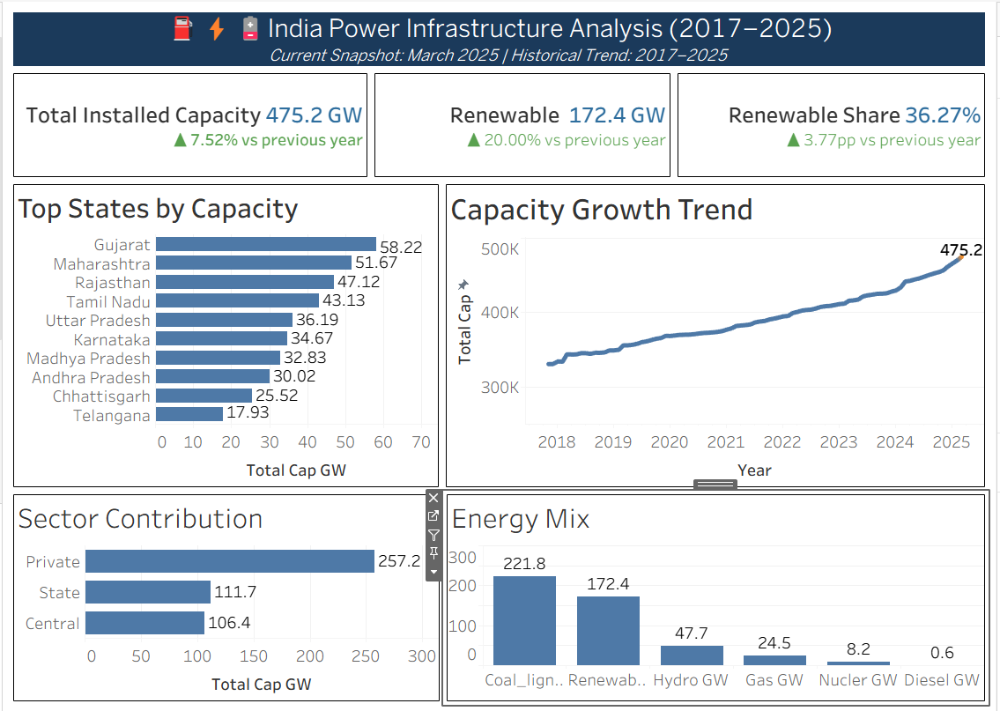
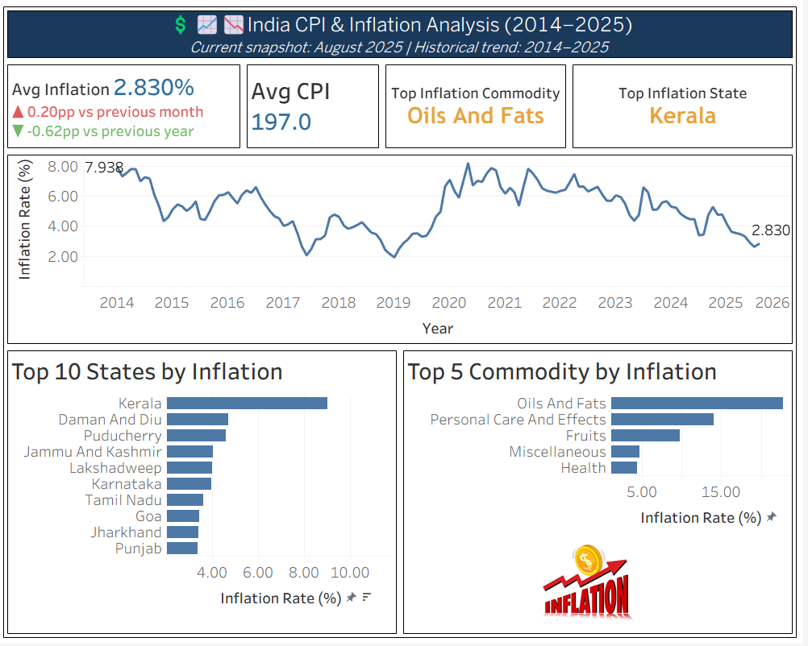
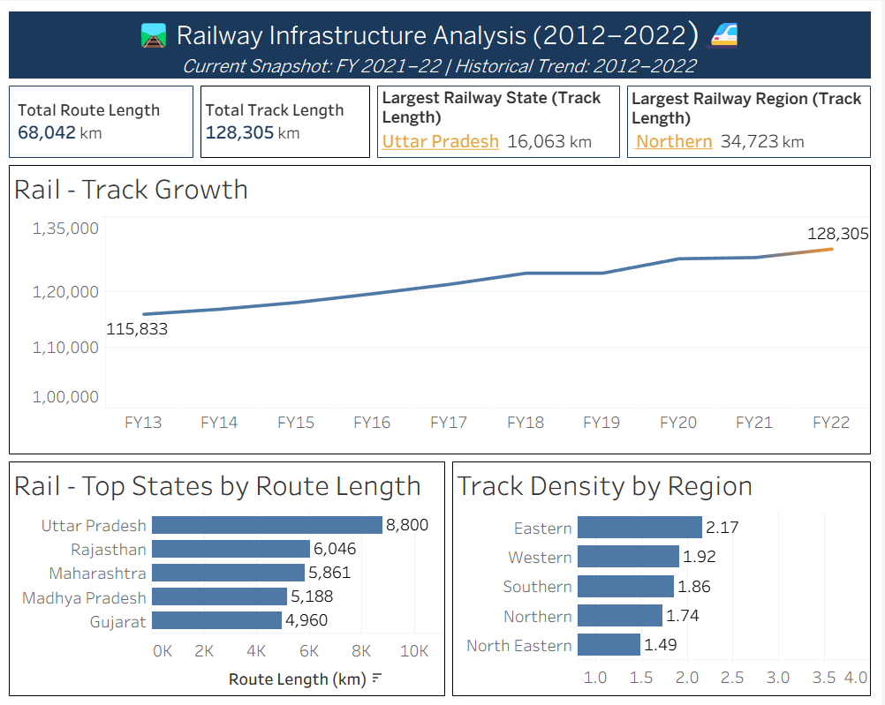

<p align="center">
  
  
  
  
  
  
</p>

<h1 align="center">
  🇮🇳 India Data Warehouse Analytics
</h1>

<p align="center">
  <b>A comprehensive end-to-end Data Warehousing & Business Intelligence solution</b><br>
  <i>Analyzing India's Power Generation, Consumer Price Index (CPI), and Railway Infrastructure</i>
</p>

<p align="center">
  <a href="#-overview">Overview</a> •
  <a href="#-features">Features</a> •
  <a href="#-architecture">Architecture</a> •
  <a href="#-data-model">Data Model</a> •
  <a href="#-dashboards">Dashboards</a> •
  <a href="#-getting-started">Getting Started</a> •
  <a href="#-project-structure">Structure</a>
</p>

---

## 📖 Overview

This project demonstrates a **production-ready Business Intelligence pipeline** that transforms raw government datasets into actionable insights through:

- 🔬 **Data Cleaning & Validation** — Jupyter notebooks with automated quality gates
- 🏗️ **Star Schema Design** — Optimized dimensional modeling for analytics
- ⚙️ **SQL ETL Pipeline** — Modular extraction, transformation, and loading scripts
- 📊 **Interactive Dashboards** — Tableau visualizations answering real business questions

> **Data Coverage:** 36 states/UTs across India | 2014–2025 time range | 20M+ data points

---

## ✨ Features

| Category | Highlights |
|:---------|:-----------|
| **🧹 Data Quality** | Automated anomaly detection, column rotation bug fixes, assertion-based validation gates |
| **📐 Modeling** | Star schema with shared dimension tables, surrogate keys, proper FK relationships |
| **🔄 ETL** | Staging → dimension → fact loading with NULLIF handling and type casting |
| **📈 Analytics** | KPI cards, time-series trends, geographic breakdowns, sector comparisons |
| **📂 Documentation** | Architecture diagrams, data dictionary, inline notebook explanations |

---

## 🏛️ Architecture

```
┌─────────────────────────────────────────────────────────────────────────────┐
│                          DATA PIPELINE ARCHITECTURE                         │
└─────────────────────────────────────────────────────────────────────────────┘

   ┌──────────────┐     ┌──────────────┐     ┌──────────────┐
   │  📄 CPI.csv  │     │ ⚡ Power.csv │     │ 🚂 Railway.csv│
   │   (19.7 MB)  │     │   (853 KB)   │     │   (12.4 KB)  │
   └──────┬───────┘     └──────┬───────┘     └──────┬───────┘
          │                    │                    │
          ▼                    ▼                    ▼
   ┌─────────────────────────────────────────────────────────┐
   │                 🐍 PYTHON DATA CLEANING                 │
   │   • Integrity checks     • Anomaly detection           │
   │   • Column rotation fix  • Assertion gates             │
   │   • Reference validation • Feature engineering         │
   └─────────────────────────┬───────────────────────────────┘
                             │
                             ▼
   ┌─────────────────────────────────────────────────────────┐
   │               🐘 POSTGRESQL STAGING LAYER               │
   │        stg_power  │  stg_cpi  │  stg_railways          │
   └─────────────────────────┬───────────────────────────────┘
                             │
                             ▼
   ┌─────────────────────────────────────────────────────────┐
   │                   ⚙️ SQL ETL PIPELINE                   │
   │   dim_load.sql → fact_load.sql (with FK constraints)   │
   └─────────────────────────┬───────────────────────────────┘
                             │
                             ▼
   ┌─────────────────────────────────────────────────────────┐
   │                 ⭐ STAR SCHEMA WAREHOUSE                │
   │  ┌─────────────────────────────────────────────────┐   │
   │  │                 FACT TABLES                     │   │
   │  │   fact_power  │  fact_cpi  │  fact_railway     │   │
   │  └─────────────────────────────────────────────────┘   │
   │                        ▲                               │
   │                        │                               │
   │  ┌─────────────────────┴─────────────────────────┐    │
   │  │              DIMENSION TABLES                  │    │
   │  │  dim_state │ dim_date │ dim_financial_year    │    │
   │  │  dim_power_sector │ dim_cpi_sector            │    │
   │  │  dim_cpi_commodity                            │    │
   │  └───────────────────────────────────────────────┘    │
   └─────────────────────────┬───────────────────────────────┘
                             │
                             ▼
   ┌─────────────────────────────────────────────────────────┐
   │               📊 TABLEAU DASHBOARDS                     │
   │   Power Analysis │ CPI/Inflation │ Railway Network     │
   └─────────────────────────────────────────────────────────┘
```

---

## 🗂️ Data Model

### Star Schema Design

<table>
<tr>
<td width="50%">

#### 📊 Fact Tables

| Table | Description | Grain |
|:------|:------------|:------|
| `fact_power` | Installed generation capacity by fuel type | State × Sector × Month |
| `fact_cpi` | CPI values and inflation rates | State × Commodity × Sector × Month |
| `fact_railway` | Route length and track metrics | State × Financial Year |

</td>
<td width="50%">

#### 📋 Dimension Tables

| Table | Description |
|:------|:------------|
| `dim_state` | 36 states/UTs with region mapping |
| `dim_date` | Calendar dimension (2014–2025) |
| `dim_financial_year` | Indian FY periods |
| `dim_power_sector` | Central / State / Private |
| `dim_cpi_sector` | Urban / Rural / Combined |
| `dim_cpi_commodity` | ~280 commodity groups |

</td>
</tr>
</table>

### Key Relationships

```sql
fact_power ──┬── FK → dim_date (date_key)
             ├── FK → dim_state (state_key)
             └── FK → dim_power_sector (power_sector_key)

fact_cpi ────┬── FK → dim_date (date_key)
             ├── FK → dim_state (state_key)
             ├── FK → dim_cpi_sector (cpi_sector_key)
             └── FK → dim_cpi_commodity (commodity_key)

fact_railway ┬── FK → dim_state (state_key)
             └── FK → dim_financial_year (fy_key)
```

---

## 📊 Dashboards

### ⚡ Power Generation Dashboard

<p align="center">
  
</p>

| KPI | Business Question |
|:----|:------------------|
| 🔋 **Total Installed Capacity** | What is India's current generation capacity? |
| 🌿 **Renewable vs Conventional** | What's the energy mix? How is it trending? |
| 🏆 **Top States** | Which states lead in power generation? |
| 🏭 **Sector Contribution** | How is capacity distributed across Central/State/Private? |
| 📈 **Growth Trends** | How has capacity evolved over time by fuel type? |

---

### 💰 Consumer Price Index (Inflation) Dashboard

<p align="center">
  
</p>

| KPI | Business Question |
|:----|:------------------|
| 📊 **Current CPI Value** | What's the latest consumer price index? |
| 🔥 **Inflation Rate** | What's the current YoY inflation? |
| 🥇 **Highest Inflation Commodity** | Which commodity group has the steepest price rise? |
| 🗺️ **Highest Inflation State** | Which state is experiencing the most inflation? |
| 📈 **Trend Analysis** | How has inflation evolved by sector and region? |

---

### 🚂 Railway Infrastructure Dashboard

<p align="center">
  
</p>

| KPI | Business Question |
|:----|:------------------|
| 🛤️ **Total Route Length** | What's India's total railway route coverage? |
| 📏 **Total Track Length** | What's the total track (including multiple lines)? |
| 🥇 **Largest Railway State** | Which state has the most extensive network? |
| 🌍 **Regional Density** | How is the railway distributed across regions? |
| 📈 **Growth Over Time** | How has the network expanded year over year? |

---

## 🚀 Getting Started

### Prerequisites

```bash
# Required
- PostgreSQL 13+
- Python 3.8+
- Tableau Desktop or Tableau Public

# Python packages
pip install pandas numpy matplotlib jupyter
pip install ydata-profiling  # optional, for data profiling reports
```

### Installation

```bash
# 1. Clone the repository
git clone https://github.com/vvajpai/india-data-warehouse-analytics.git
cd india-data-warehouse-analytics

# 2. Run data cleaning notebooks
jupyter notebook data_cleaning/india-cpi-data-cleaning/notebook/cpi.ipynb
jupyter notebook data_cleaning/india_state_power_cap/notebook/power.ipynb
jupyter notebook data_cleaning/india-railway-network-data-cleaning/notebook/railways.ipynb

# 3. Set up PostgreSQL warehouse
psql -U postgres -f sql/schema_and_staging_table.sql
psql -U postgres -f sql/dim_and_fact_table.sql

# 4. Load staging tables (use COPY or your preferred method)
# 5. Run ETL scripts
psql -U postgres -f sql/dim_load.sql
psql -U postgres -f sql/fact_load.sql

# 6. Open Tableau workbook
# Tableau/India_Data_Warehouse_Analytics.twb
```

---

## 📁 Project Structure

```
india-data-warehouse-analytics/
│
├── 📊 Tableau/
│   └── India_Data_Warehouse_Analytics.twb    # Main Tableau workbook
│
├── 🖼️ dashboard_images/
│   ├── infation_cpi_dashboard.png            # CPI dashboard screenshot
│   ├── power_dashboard.png                   # Power dashboard screenshot
│   ├── railway_dashboard.png                 # Railway dashboard screenshot
│   └── *.twb                                 # Individual dashboard workbooks
│
├── 🧹 data_cleaning/
│   ├── india-cpi-data-cleaning/
│   │   ├── data/
│   │   │   ├── raw/consumer-price-index.csv
│   │   │   └── processed/consumer-price-index-cleaned.csv
│   │   └── notebook/cpi.ipynb
│   │
│   ├── india_state_power_cap/
│   │   ├── data/
│   │   │   ├── raw/installed-capacity-statewise.csv
│   │   │   └── processed/installed-capacity-statewise-clean.csv
│   │   ├── notebook/power.ipynb
│   │   └── README.md
│   │
│   └── india-railway-network-data-cleaning/
│       ├── data/
│       │   ├── raw/railway-networks.csv
│       │   └── processed/railway-networks-clean.csv
│       └── notebook/railways.ipynb
│
├── 📄 datasets/                              # Final cleaned datasets
│   ├── consumer-price-index.csv              # ~19.7 MB, 280+ commodities
│   ├── installed-capacity-statewise.csv      # ~853 KB, monthly state-wise
│   └── railway-networks.csv                  # ~12 KB, annual state-wise
│
├── 📚 docs/
│   ├── architecture.drawio.png               # Visual architecture diagram
│   ├── data_dictionary.md                    # Table & column descriptions
│   └── star_schema.pdf                       # ER diagram of star schema
│
├── 🗃️ sql/
│   ├── schema_and_staging_table.sql          # Schema & staging DDL
│   ├── dim_and_fact_table.sql                # Dimension & fact DDL
│   ├── dim_load.sql                          # Dimension population
│   └── fact_load.sql                         # Fact table population
│
├── 📜 LICENSE                                # MIT License
└── 📖 README.md                              # This file
```

---

## 🔬 Data Quality Highlights

### Power Data — Column Rotation Bug Fix

The raw power dataset contained a **cyclic column mislabeling** bug affecting `nuclear`, `hydro`, and `res` columns before Dec-2021. This was:

1. ✅ **Detected** via time-series visualization (impossible "non-Central nuclear" values)
2. ✅ **Diagnosed** through boundary analysis at Nov→Dec 2021
3. ✅ **Fixed** by reversing the column rotation for affected rows only
4. ✅ **Validated** with assertion gates (no nulls, no negatives, no discontinuities)

### CPI Data — Missing Value Handling

The CPI dataset contains legitimate `NULL` values (not all commodities are measured in all states). The ETL handles this with:

```sql
NULLIF(NULLIF(TRIM(sc.cpi),''),'NULL')::NUMERIC
```

---

## 📈 Datasets Summary

| Dataset | Records | Size | Time Range | Grain |
|:--------|--------:|-----:|:-----------|:------|
| **Power** | ~10,000 | 853 KB | Nov 2017 – Mar 2025 | State × Sector × Month |
| **CPI** | ~285,000 | 19.7 MB | Jan 2014 – Present | State × Commodity × Sector × Month |
| **Railway** | ~350 | 12 KB | FY 2014-15 – Present | State × Financial Year |

---

## 🛠️ Technology Stack

<table>
<tr>
<td align="center" width="120">

<br><b>PostgreSQL</b>
<br><sub>Data Warehouse</sub>
</td>
<td align="center" width="120">

<br><b>Python</b>
<br><sub>Data Cleaning</sub>
</td>
<td align="center" width="120">

<br><b>Pandas</b>
<br><sub>Data Analysis</sub>
</td>
<td align="center" width="120">

<br><b>Jupyter</b>
<br><sub>Notebooks</sub>
</td>
<td align="center" width="120">

<br><b>Tableau</b>
<br><sub>Visualization</sub>
</td>
</tr>
</table>

---

## 📜 License

This project is licensed under the **MIT License** — see the [LICENSE](LICENSE) file for details.

---

## 👤 Author

**Vaibhav Vajpai**

<p>
  <a href="https://github.com/vvajpai">
    
  </a>
</p>

---

<p align="center">
  <b>⭐ Star this repository if you found it helpful!</b>
</p>

<p align="center">
  Made with ❤️ in India
</p>
